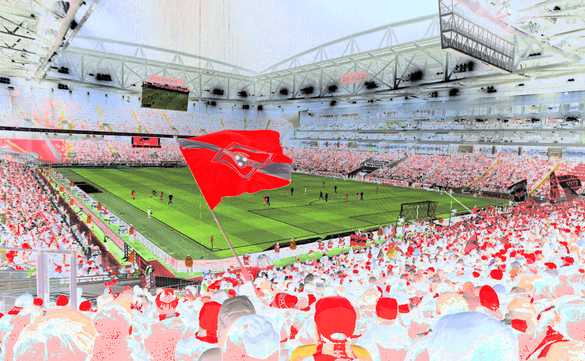

# Лабораторная работа №1
## Цветовые модели и передискретизация изображений

### Цель работы

Изучить цветовые модели RGB и HSI, научиться выделять отдельные компоненты изображения, а также реализовать алгоритмы передискретизации (растяжение, сжатие, двух- и однопроходная передискретизация) **без использования библиотечных функций масштабирования**.

### Исходное изображение

В качестве исходных данных используется полноцветное трёхканальное изображение в формате PNG.

### 1. Цветовые модели

#### 1.1 Компоненты R, G, B

На первом этапе исходное изображение было разложено на три канала: красный (R), зелёный (G) и синий (B). Каждый канал сохранён как отдельное полутоновое изображение.

|             Красный канал              |             Зелёный канал              |              Синий канал               |
|:--------------------------------------:|:--------------------------------------:|:--------------------------------------:|
|  |  |  |

По полученным изображениям хорошо видно, какие области сцены вносят наибольший вклад в соответствующий цветовой канал.

#### 1.2 Яркостная компонента HSI

Далее изображение было приведено к цветовой модели HSI. Для этого реализовано преобразование RGB→HSI, после чего была выделена яркостная компонента I и сохранена как отдельное изображение.

На яркостной компоненте исчезает цветовая информация, остаётся только распределение яркости по изображению.

#### 1.3 Инвертирование яркостной компоненты

Яркостная компонента I была инвертирована по формуле I' = 1 - I. Затем по компонентам H, S и новой яркости I' было выполнено обратное преобразование HSI→RGB. Таким образом получается производное изображение, в котором сохраняются тон и насыщенность, но инвертирована яркость.

|            Исходное изображение            |                  С инвертированной яркостью                   |
|:------------------------------------------:|:-------------------------------------------------------------:|
|  |  |

### 2. Передискретизация (M=1.5, N=2, K=0.75)

Для изучения передискретизации реализованы собственные функции интерполяции и децимации. Библиотечные функции (`resize` и аналоги) не использовались.

#### 2.1 Растяжение в M раз (метод билинейной интерполяции)

Растяжение выполняется с коэффициентом M = 1.5. Для каждого пикселя выходного изображения его координаты пересчитываются в вещественные координаты исходного изображения, после чего цвет рассчитывается по билинейной интерполяции четырёх ближайших пикселей.

|                  Исходное                  |                   Растянутое                   |
|:------------------------------------------:|:----------------------------------------------:|
|  |  |

#### 2.2 Сжатие в N раз (метод прореживания)

Сжатие выполняется с коэффициентом \(N = 2\) путём прореживания отсчётов: берётся каждый второй пиксель по вертикали и горизонтали. Таким образом реализуется децимация без предварительной фильтрации.

|                  Исходное                  |                    Сжатое                    |
|:------------------------------------------:|:--------------------------------------------:|
|  |  |

#### 2.3 Двухпроходная передискретизация (растяжение + сжатие)

Для коэффициента K = M/N = 0.75 передискретизация выполняется в два прохода:

1. Растяжение изображения в \(M = 1{,}5\) раза методом билинейной интерполяции;
2. Сжатие полученного изображения в \(N = 2\) раза методом прореживания.

|                  Исходное                  |             Результат двух проходов             |
|:------------------------------------------:|:-----------------------------------------------:|
|  |  |

#### 2.4 Однопроходная передискретизация (прямое масштабирование)

Во втором варианте передискретизация до того же коэффициента K = 0.75 выполняется за один проход. Для каждого пикселя выходного изображения по формулам x' = x / K, y' = y / K находятся соответствующие координаты в исходном изображении, а цвет вычисляется с помощью билинейной интерполяции.

|                  Исходное                  |            Результат одного прохода             |
|:------------------------------------------:|:-----------------------------------------------:|
|  |  |

### Результаты выполнения

Ниже приведены реальные размеры изображений до и после операций (в пикселях), измеренные для использованного исходного изображения:

| Операция                          | Размер изображения |
|:----------------------------------|-------------------:|
| Исходное изображение              | 1180×730           |
| Растяжение (M=1.5)                | 1770×1095          |
| Сжатие (N=2)                      | 590×365            |
| Двухпроходная (растяжение 1.5 + сжатие 2) | 885×548  |
| Однопроходная (K=0.75)            | 885×548            |

### Выводы

1. **Цветовые модели RGB и HSI**  
   - Выделены компоненты красного, зелёного и синего каналов, что позволило наглядно увидеть вклад каждого канала в формирование итогового изображения.  
   - Реализовано преобразование RGB→HSI и получена яркостная компонента I.  
   - Выполнено инвертирование яркостной компоненты и получено производное изображение с сохранением оттенка и насыщенности.

2. **Методы передискретизации**  
   - Реализован собственный алгоритм билинейной интерполяции для растяжения изображения.  
   - Реализована децимация (сжатие) путём прореживания пикселей без использования библиотечных функций.  
   - Выполнены операции растяжения (M=1.5) и сжатия (N=2), а также двухпроходная и однопроходная передискретизация с коэффициентом K=M/N.  
   - Продемонстрировано, что при одинаковом итоговом коэффициенте масштабирования результаты двухпроходной и однопроходной передискретизации могут отличаться из‑за различий в последовательности интерполяции и прореживания, а также накопления ошибок округления.

