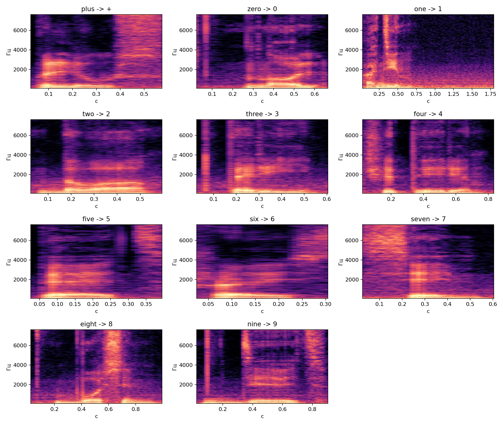
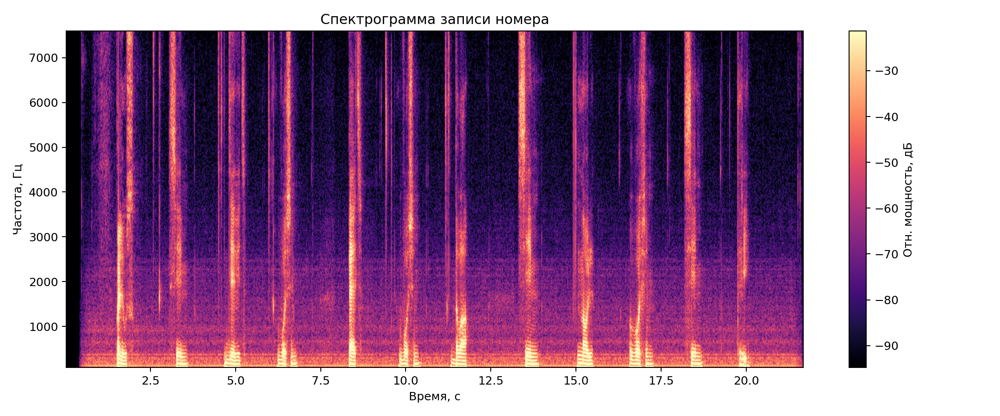
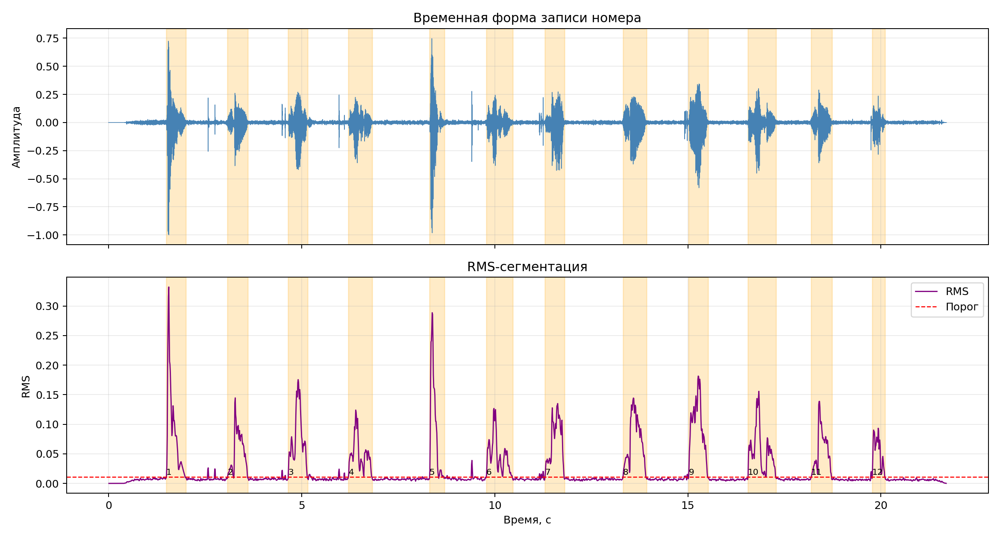
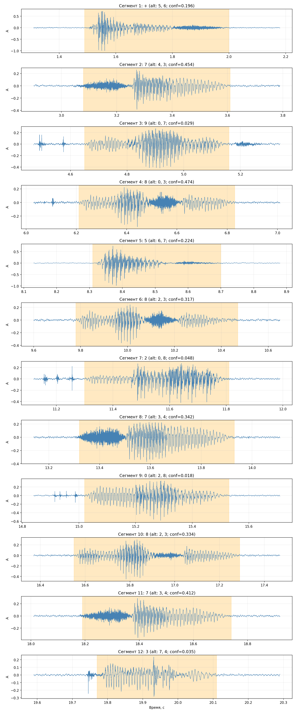
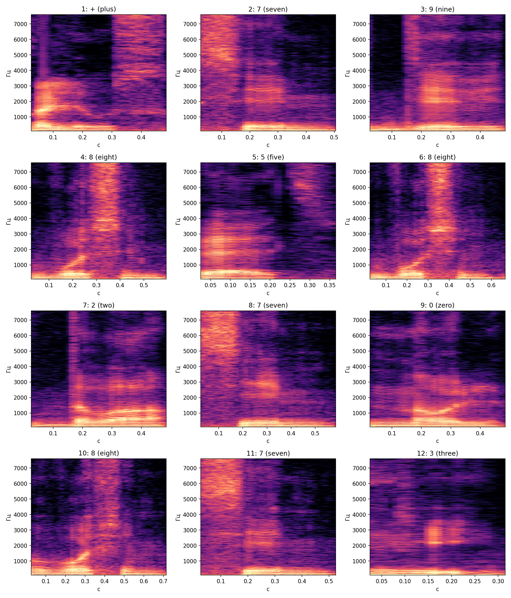

# Лабораторная работа №10

## Обработка голоса: анализатор речи

### Вариант 3


## Цель работы

Построить простой анализатор речи для телефонного номера на ограниченном словаре из 11 слов: получить спектрограмму, выделить речевые сегменты по энергии, сопоставить каждый сегмент с эталоном и оценить качество распознавания.

## Исходные данные

Работа выполнена по файлам из `lab10/src`:

- `plus.wav`, `zero.wav`, `one.wav`, `two.wav`, `three.wav`, `four.wav`, `five.wav`, `six.wav`, `seven.wav`, `eight.wav`, `nine.wav` — эталонные образцы алфавита;
- `my_number.wav` — запись телефонного номера.

Алфавит распознавания:

| Слово | Символ |
|:---|:---:|
| `plus` | `+` |
| `zero` | `0` |
| `one` | `1` |
| `two` | `2` |
| `three` | `3` |
| `four` | `4` |
| `five` | `5` |
| `six` | `6` |
| `seven` | `7` |
| `eight` | `8` |
| `nine` | `9` |

Параметры записи номера:

| Параметр | Значение |
|:---|---:|
| Формат | `WAV` |
| Каналов | `1` |
| Частота дискретизации | `48000` Гц |
| Число отсчётов | `1041600` |
| Длительность | `21.70` с |

## План выполнения

1. Загрузить WAV-файлы алфавита и записи номера.
2. Привести сигналы к моно-формату и единой частоте `16000` Гц.
3. Построить спектрограммы по STFT с окном Ханна.
4. Вычислить кривую `RMS` по коротким окнам и выделить речевые участки.
5. Сохранить найденные сегменты и их временные границы.
6. Для эталонов и сегментов вычислить спектральные признаки.
7. Выполнить сопоставление сегментов с эталонами по мере близости.
8. Получить итоговую цепочку символов, оценку достоверности и число ошибок.

## Теоретические сведения

Для анализа речи используется **кратковременное преобразование Фурье**:

$$
X(m, \omega) = \sum_n x[n] \, w[n-m] \, e^{-j\omega n},
$$

где $x[n]$ — дискретный аудиосигнал, $w[n]$ — оконная функция, $m$ — номер временного положения окна.

В работе применялось **окно Ханна**:

$$
w(n) = 0.5 - 0.5\cos\left(\frac{2\pi n}{N-1}\right).
$$

Спектрограмма строится по квадрату модуля локального спектра:

$$
S(m, \omega) = |X(m, \omega)|^2.
$$

Для сегментации использовалась кратковременная энергия в форме `RMS`:

$$
RMS = \sqrt{\frac{1}{N}\sum_{k=1}^{N} x_k^2}.
$$

Речевые участки имеют заметно больший `RMS`, чем паузы, поэтому по кривой `RMS` можно выделять слова в записи номера.

Для сравнения сегмента с шаблоном использовалась комбинированная мера, включающая:

- косинусное расстояние между векторами `MFCC`;
- косинусное расстояние между векторами `log-mel`;
- расстояние `DTW` между последовательностями `MFCC`;
- различие траекторий спектрального центра;
- различие длительностей.

Итоговый балл сопоставления:

$$
d = 0.34d_{\text{mfcc}} + 0.24d_{\log mel} + 0.18d_{\text{dtw}} + 0.12d_{\text{centroid}} + 0.12d_{\text{dur}}.
$$

Чем меньше $d$, тем ближе сегмент к эталонному слову.

Оценка достоверности вычислялась по отрыву лучшего варианта от второго:

$$
confidence = \frac{d_2 - d_1}{d_2},
$$

где $d_1$ — расстояние до лучшего шаблона, $d_2$ — расстояние до второго по близости шаблона.


## Параметры обработки

| Параметр | Значение |
|:---|:---|
| Частота после пересчёта | `16000` Гц |
| Окно спектрограммы | Ханна |
| Длина окна STFT | `0.050` с |
| Шаг окна STFT | `0.010` с |
| Число мел-полос | `32` |
| Число `MFCC` | `13` |
| Диапазон анализа | `80..7600` Гц |
| Размер нормированного вектора | `64` временных отсчёта |
| Число найденных сегментов | `12` |

## Численные результаты

В ходе сегментации в записи `my_number.wav` выделено `12` речевых сегментов.

Границы сегментов:

| № | Начало, с | Конец, с | Длительность, с |
|:---:|---:|---:|---:|
| `1` | `1.49` | `2.00` | `0.51` |
| `2` | `3.08` | `3.61` | `0.53` |
| `3` | `4.65` | `5.16` | `0.51` |
| `4` | `6.21` | `6.83` | `0.62` |
| `5` | `8.31` | `8.70` | `0.39` |
| `6` | `9.78` | `10.47` | `0.69` |
| `7` | `11.30` | `11.81` | `0.51` |
| `8` | `13.32` | `13.93` | `0.61` |
| `9` | `15.02` | `15.53` | `0.51` |
| `10` | `16.55` | `17.29` | `0.74` |
| `11` | `18.19` | `18.74` | `0.55` |
| `12` | `19.77` | `20.11` | `0.34` |

Для контроля ошибок в скрипте использована строка

```text
+79858270873
```


Итоговое распознавание:

| Показатель | Значение |
|:---|:---|
| Эталонная строка | `+79858270873` |
| Распознанная строка | `+79858270873` |
| Число сегментов | `12` |
| Число ошибок | `0` |
| Точность | `100.00 %` |
| Средняя достоверность | `0.240215` |

Фрагмент таблицы сопоставления:


В таблице каждая гипотеза записана как пара `слово -> символ`, то есть сначала указывается имя эталонного WAV-шаблона, а затем символ, который ему соответствует:

- `plus -> +`
- `zero -> 0`
- `one -> 1`
- `two -> 2`
- `three -> 3`
- `four -> 4`
- `five -> 5`
- `six -> 6`
- `seven -> 7`
- `eight -> 8`
- `nine -> 9`

| Сегмент | 1-я гипотеза | 2-я гипотеза | 3-я гипотеза | Достоверность |
|:---:|:---|:---|:---|---:|
| `1` | `plus -> +` | `five -> 5` | `six -> 6` | `0.195941` |
| `2` | `seven -> 7` | `four -> 4` | `three -> 3` | `0.454215` |
| `3` | `nine -> 9` | `zero -> 0` | `seven -> 7` | `0.028791` |
| `4` | `eight -> 8` | `zero -> 0` | `three -> 3` | `0.473949` |
| `5` | `five -> 5` | `six -> 6` | `seven -> 7` | `0.223911` |
| `6` | `eight -> 8` | `two -> 2` | `three -> 3` | `0.317031` |
| `7` | `two -> 2` | `zero -> 0` | `eight -> 8` | `0.048137` |
| `8` | `seven -> 7` | `three -> 3` | `four -> 4` | `0.341903` |
| `9` | `zero -> 0` | `two -> 2` | `eight -> 8` | `0.017768` |
| `10` | `eight -> 8` | `two -> 2` | `three -> 3` | `0.333618` |
| `11` | `seven -> 7` | `three -> 3` | `four -> 4` | `0.412389` |
| `12` | `three -> 3` | `seven -> 7` | `four -> 4` | `0.034922` |


Полные таблицы сохранены в:

- `lab10/src/segments.csv`;
- `lab10/src/matches.csv`;
- `lab10/src/summary.json`.

## Визуальные результаты

### Эталонные спектрограммы словаря



### Спектрограмма записи номера



На спектрограмме отчётливо видны отдельные речевые всплески, разделённые паузами, что позволило применять энерго-пороговую сегментацию.

### Сегментация по RMS



Кривая `RMS` показывает 12 устойчивых участков выше порога. Это соответствует количеству символов в эталонной строке `+79858270873`.

### Сопоставление сегментов



По разметке видно, что часть сегментов выделяется уверенно, однако по нескольким позициям отрыв лучшего шаблона от второго очень мал, поэтому достоверность падает почти до нуля.

### Галерея сегментов



Галерея спектрограмм показывает, что отдельные цифры действительно близки по спектральной структуре. Особенно заметна путаница между короткими словами и словами с близкими формантными областями.


## Выводы

1. По условию варианта 3 реализован анализатор речи для телефонного номера на ограниченном словаре из `11` слов.
2. Построена спектрограмма записи номера с использованием STFT и окна Ханна.
3. Реализована сегментация по кратковременной энергии `RMS`; в записи найдено `12` речевых сегментов.
4. Реализовано сопоставление сегментов с эталонами по комбинированной спектральной мере.
5. Для эталонной строки `+79858270873` получен тот же результат `+79858270873`, поэтому число ошибок равно `0`.
6. Работа показала, что для ограниченного словаря и одной записи можно получить точное распознавание, однако устойчивость алгоритма на других записях всё равно зависит от качества сегментации, количества шаблонов и вариативности произношения.
