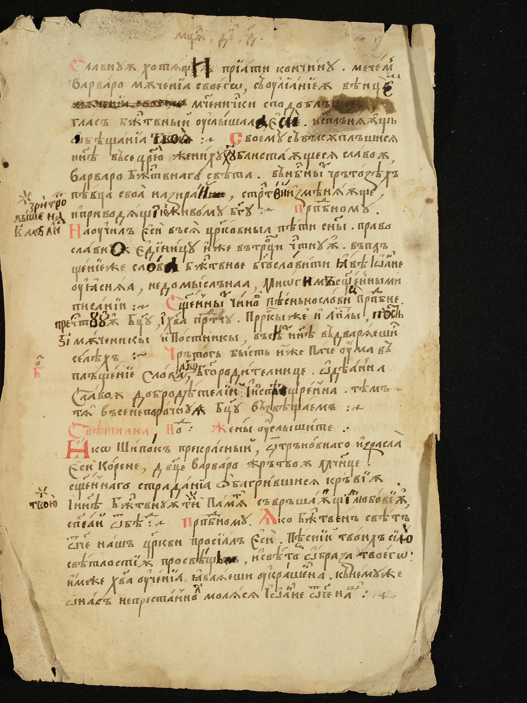
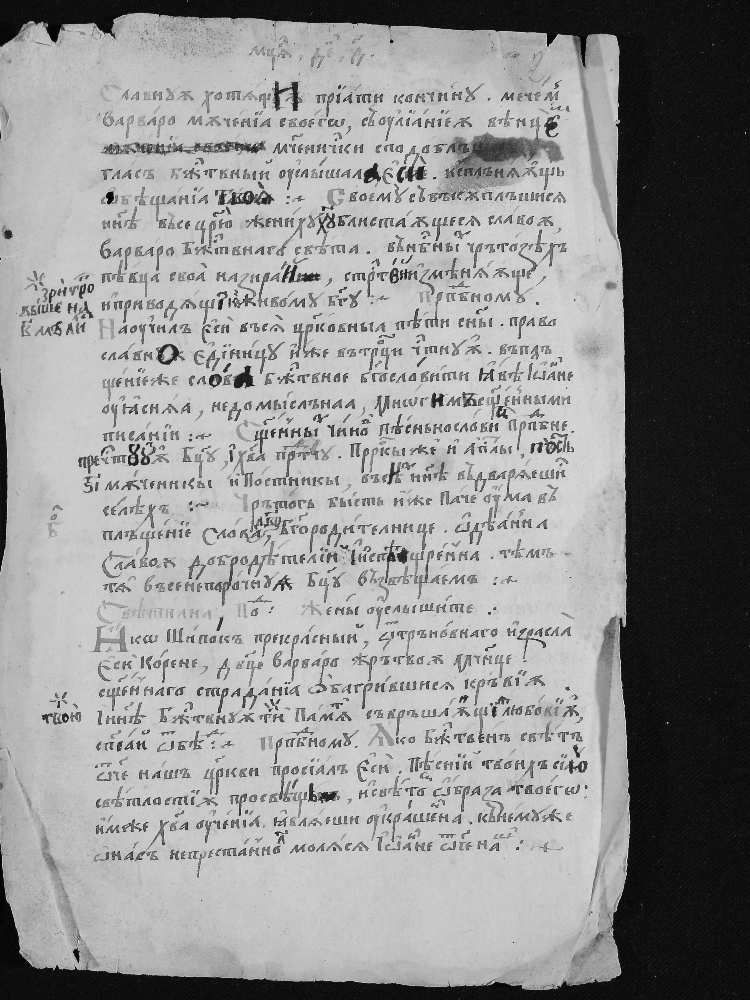
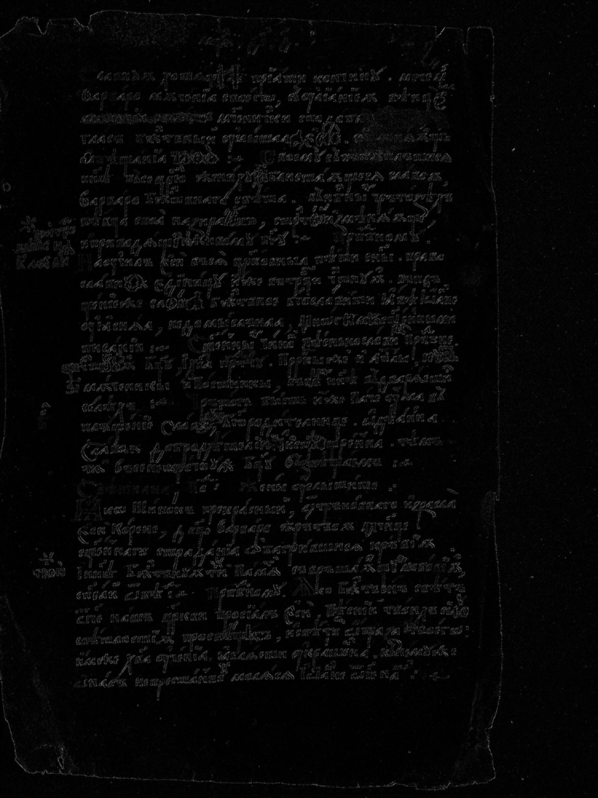
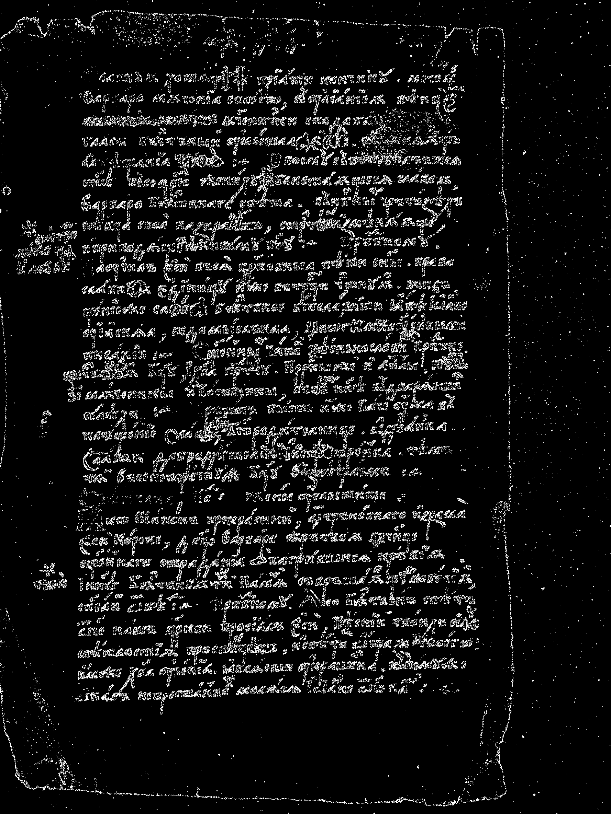

# Лабораторная работа №4

## Выделение контуров. Вариант 14 — оператор Кайяли 3×3

$$
G = |G_x| + |G_y|
$$

### Цель работы

Изучить градиентные методы выделения контуров, реализовать оператор Кайяли 3×3 для полутонового изображения, получить и визуализировать градиентные матрицы \(G_x\), \(G_y\), модуль градиента \(G\), а также бинаризованную карту контуров.

### Теоретические сведения

Для цифрового изображения \(f(x, y)\) **градиент** определяется как вектор частных производных по координатам:

$$
\nabla f(x, y) =
\begin{pmatrix}
G_x(x, y) \\
G_y(x, y)
\end{pmatrix}
$$

`=`

$$
\begin{pmatrix}
\dfrac{\partial f}{\partial x} \\
\dfrac{\partial f}{\partial y}
\end{pmatrix}
$$

Модуль градиента характеризует скорость изменения яркости и достигает максимума на контурах объектов. В данной работе модуль вычисляется по манхэттенской норме:

$$
G(x, y) = |G_x(x, y)| + |G_y(x, y)|.
$$

**Оператор Кайяли 3×3** аппроксимирует частные производные свёрткой с ядрами:

$$
G_x =
\begin{pmatrix}
6 & 0 & -6 \\
0 & 0 & 0 \\
-6 & 0 & 6
\end{pmatrix},
\qquad
G_y =
\begin{pmatrix}
-6 & 0 & 6 \\
0 & 0 & 0 \\
6 & 0 & -6
\end{pmatrix}.
$$

Для визуализации градиентных матриц значения нормируются в диапазон \([0, 255]\):

$$
f_{\text{norm}}(x, y) =
255 \cdot \frac{f(x, y) - f_{\min}}{f_{\max} - f_{\min}},
$$

где \(f_{\min}\), \(f_{\max}\) — минимальное и максимальное значения матрицы соответственно.

Бинаризация модуля градиента выполняется по пороговому решающему правилу:

$$
G_{\text{bin}}(x, y) =
\begin{cases}
1, & \text{если } G(x, y) \ge T, \\
0, & \text{иначе},
\end{cases}
$$

где порог \(T\) выбран как доля от максимального значения модуля градиента:

$$
T = \dfrac{\max G}{12}.
$$

Для перевода исходного цветного изображения в полутоновое используется взвешенное усреднение каналов RGB (формула ITU-R BT.601):

$$
Y = 0.299 \cdot R + 0.587 \cdot G + 0.114 \cdot B.
$$

### 1. Исходное и полутоновое изображение

| Исходное цветное изображение | Полутоновое изображение |
|:----------------------------:|:------------------------:|
|  |  |

Полутоновое изображение сохраняет структуру текста и фона, позволяя далее применять градиентные операторы.

### 2. Градиентные матрицы \(G_x\), \(G_y\), \(G\)

К полутоновому изображению применён оператор Кайяли 3×3. Свёртка выполняется с нулевым дополнением по краям изображения, для каждой позиции окна 3×3 вычисляется сумма произведений яркостей на коэффициенты ядра.

После свёртки получены матрицы частных производных \(G_x\) и \(G_y\), а затем рассчитан модуль градиента \(G = |G_x| + |G_y|\). Для наглядности все три матрицы нормированы в диапазон \([0, 255]\) и сохранены как полутоновые изображения.

| \(G_x\) (нормировано) | \(G_y\) (нормировано) | \(G\) (нормировано) |
|:---------------------:|:---------------------:|:-------------------:|
|  |  |  |

Ниже приведены увеличенные копии карт градиента по осям (масштаб ×2), чтобы детали контуров были лучше различимы при просмотре отчёта.

| \(G_x\) увеличенное | \(G_y\) увеличенное |
|:-------------------:|:-------------------:|
|  |  |

На изображении \(G_x\) хорошо видны вертикальные переходы яркости (границы штрихов и полей), на \(G_y\) — горизонтальные структуры. Матрица \(G\) подчёркивает области с наибольшим суммарным изменением яркости, формируя яркие контурные линии вокруг элементов текста и декора.

### 3. Бинаризованная матрица модуля градиента

Максимальное значение модуля градиента для выбранного изображения оказалось примерно **2652** (это значение \(\max G\)). Порог бинаризации выбран по формуле:

$$
T = \frac{\max G}{12} \approx 221.
$$

Полученное бинарное изображение:

| Бинаризованный модуль градиента $G_{\text{bin}}$ |
|:--------------------------------------------------:|
|  |

При таком значении порога сохраняются основные контуры букв и декоративных элементов, при этом подавляется значительная часть слабых шумовых границ в однородных областях фона. Уменьшение порога привело бы к появлению большого количества слабых и разорванных контуров, а увеличение — к исчезновению тонких деталей штрихов.

### 4. Выводы

1. Реализован оператор Кайяли 3×3 для полутонового изображения с использованием свёртки с ядрами \(G_x\) и \(G_y\), заданными в методических материалах.  
2. Получены и нормированы в диапазон \([0, 255]\) градиентные матрицы \(G_x\), \(G_y\) и модуль градиента \(G = |G_x| + |G_y|\), что позволило визуально проанализировать вклад горизонтальных и вертикальных производных в выделение границ.  
3. Выполнена пороговая бинаризация модуля градиента c порогом T = \(max G\) / \(12\); полученное контурное изображение содержит основные границы текста и иллюстраций при умеренном уровне шума.  

