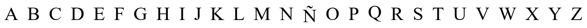
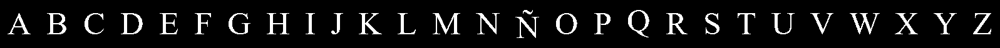
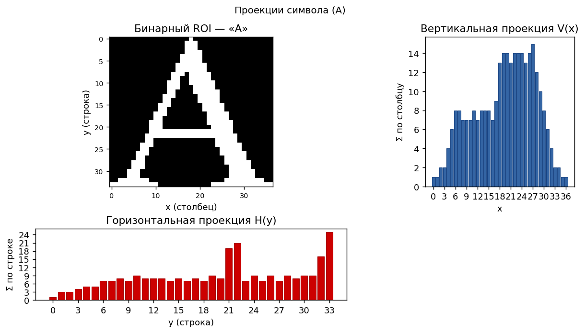
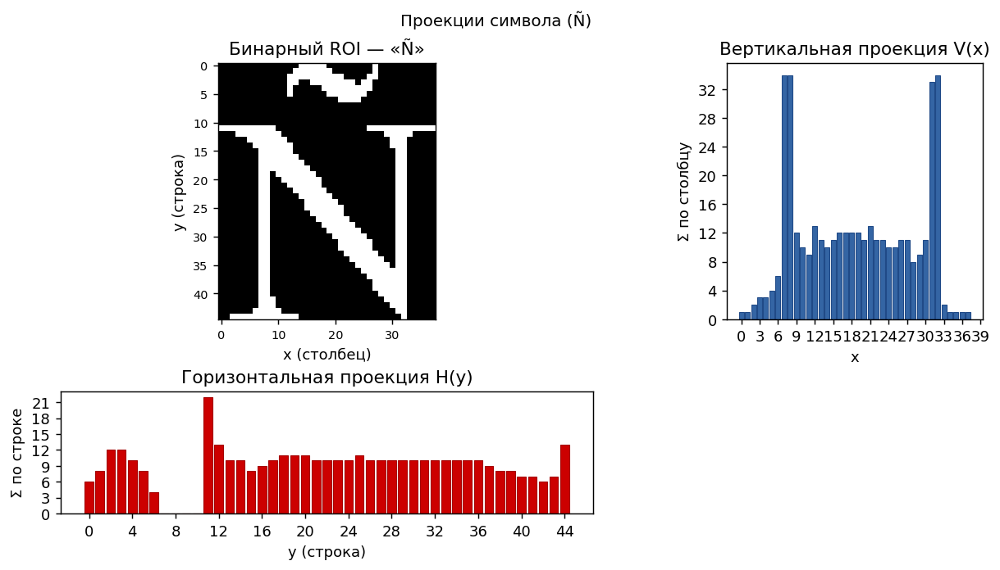
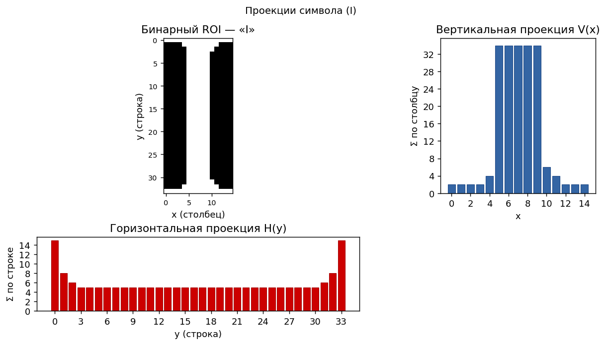

# Лабораторная работа №5

## Выделение и анализ признаков символов

### Вариант 14 (бакалавр)

Испанский алфавит **заглавными** буквами: `ABCDEFGHIJKLMNÑOPQRSTUVWXYZ` (27 символов). Эталонное изображение синтезируется шрифтом **Times New Roman**, кегль **52 pt**. Выполняются **бинаризация Оцу**, выделение ROI символов, расчёт **геометрических признаков**, **инвариантов Ху**, **горизонтальной и вертикальной проекций**, построение **матрицы евклидовых расстояний** между векторами признаков. Каждая буква сохраняется отдельным файлом.

### Цель работы

Изучить **структурные и геометрические признаки** изображений символов, освоить **проекции**, **моменты** и **инварианты Ху**, оценить **различимость** знаков в выбранном пространстве признаков.

### Теоретические сведения

Для бинарного изображения объекта задаётся маска значений

$$
I(x, y) \in \{0, 1\}.
$$

В реализации единице соответствуют пиксели чернил после пороговой обработки.

**Горизонтальная** и **вертикальная проекции**:

$$
H(y) = \sum_x I(x, y), \qquad V(x) = \sum_y I(x, y).
$$

Они показывают заполненность строк и столбцов и применяются при сегментации строк и символов на сканах.

**Компактность** (характеристика формы контура):

$$
C = \dfrac{P^2}{S},
$$

где $S$ — площадь объекта (число единичных пикселей), $P$ — суммарная «длина» **4-связной** границы (вклад каждого пикселя контура равен числу соседей-фона).

**Инварианты Ху** — семь величин

$$
\varphi_1,\ \varphi_2,\ \ldots,\ \varphi_7;
$$

они строятся из центральных моментов и в задачах распознавания дают описание формы, устойчивое к сдвигу, изменению масштаба и (в непрерывной модели) к повороту.

**Метод Оцу** выбирает порог глобальной бинаризации полутона так, чтобы максимизировать межклассовую дисперсию между фоном и объектом.

### Параметры синтеза данных

| Параметр | Значение |
|:---------|:---------|
| Шрифт | Times New Roman (`times.ttf`) |
| Кегль | 52 pt (`--font-size`) |
| Регистр | заглавные |
| Строка символов | ABCDEFGHIJKLMNÑOPQRSTUVWXYZ |

### 1. Полутоновое изображение строки алфавита

### 2. Бинаризация (Оцу)

Для полученного полутона автоматически найден порог Оцу

$$
T = 134.
$$

Пиксель отнесён к объекту (чернилам), если яркость полутона удовлетворяет условию

$$
I_{\mathrm{gray}}(x, y) \le T.
$$

| Полутон | Бинарный результат |
|:-------:|:------------------:|
|  |  |

### 3. Бинарное изображение каждого символа (после обрезки по чернилам)

Файлы: `char_A.png` … `char_Z.png`, для буквы **Ñ** — `char_Ntilde.png`.

| A | B | C | D | E | F | G | H | I |
|:---:|:---:|:---:|:---:|:---:|:---:|:---:|:---:|:---:|
|  |  |  |  |  |  |  |  |  |

| J | K | L | M | N | Ñ | O | P | Q |
|:---:|:---:|:---:|:---:|:---:|:---:|:---:|:---:|:---:|
|  |  |  |  |  |  |  |  |  |

| R | S | T | U | V | W | X | Y | Z |
|:---:|:---:|:---:|:---:|:---:|:---:|:---:|:---:|:---:|
|  |  |  |  |  |  |  |  |  |

### 4. Проекции (примеры для A, Ñ, I)

Слева направо: обрезанный ROI, **горизонтальная** проекция $H(y)$ (полоса под глифом), **вертикальная** $V(x)$ (столбики справа).

| A | Ñ | I |
|:-:|:-:|:-:|
|  |  |  |

### 5. Сводная таблица признаков

В таблице ниже используются обозначения:

$$
S \text{ — площадь (число пикселей объекта),}
$$

$$
W \times H \text{ — габариты ограничивающего прямоугольника после обрезки,}
$$

$$
a = \dfrac{W}{H},\qquad C = \dfrac{P^2}{S},
$$

$$
\varphi_1,\ \varphi_2 \text{ — первые два инварианта Ху.}
$$

| Символ | S | W × H | a | C | φ₁ | φ₂ |
|:------:|--:|:-----:|--:|--:|---:|---:|
| A | 292 | 37×34 | 1.088 | 178.027 | 5.09e-01 | 6.11e-03 |
| B | 438 | 31×34 | 0.912 | 159.123 | 4.25e-01 | 5.96e-03 |
| C | 271 | 31×34 | 0.912 | 168.989 | 7.72e-01 | 3.62e-02 |
| D | 422 | 35×34 | 1.029 | 143.403 | 5.40e-01 | 5.65e-05 |
| E | 324 | 29×34 | 0.853 | 180.753 | 5.67e-01 | 5.25e-02 |
| F | 272 | 26×34 | 0.765 | 132.721 | 5.55e-01 | 1.12e-01 |
| G | 348 | 35×34 | 1.029 | 179.598 | 6.44e-01 | 2.77e-03 |
| H | 429 | 36×34 | 1.059 | 162.462 | 5.10e-01 | 4.39e-05 |
| I | 198 | 15×34 | 0.441 | 70.323 | 6.28e-01 | 3.35e-01 |
| J | 203 | 19×34 | 0.559 | 75.744 | 6.38e-01 | 3.07e-01 |
| K | 406 | 37×34 | 1.088 | 193.103 | 4.64e-01 | 2.09e-02 |
| L | 246 | 29×34 | 0.853 | 104.065 | 7.07e-01 | 2.06e-01 |
| M | 506 | 44×34 | 1.294 | 250.466 | 5.13e-01 | 1.47e-02 |
| N | 341 | 38×34 | 1.118 | 223.390 | 5.78e-01 | 7.84e-03 |
| Ñ | 401 | 38×45 | 0.844 | 281.536 | 6.00e-01 | 3.13e-02 |
| O | 368 | 34×34 | 1.000 | 156.522 | 6.12e-01 | 9.59e-03 |
| P | 324 | 26×34 | 0.765 | 113.778 | 4.48e-01 | 4.40e-02 |
| Q | 425 | 34×44 | 0.773 | 192.461 | 6.10e-01 | 6.21e-03 |
| R | 411 | 34×34 | 1.000 | 156.973 | 4.16e-01 | 1.55e-02 |
| S | 293 | 23×34 | 0.676 | 177.420 | 5.13e-01 | 4.38e-02 |
| T | 256 | 28×34 | 0.824 | 107.641 | 6.35e-01 | 1.47e-01 |
| U | 294 | 37×34 | 1.088 | 173.728 | 7.75e-01 | 3.55e-03 |
| V | 268 | 37×34 | 1.088 | 164.552 | 5.95e-01 | 1.31e-02 |
| W | 459 | 48×34 | 1.412 | 245.961 | 4.60e-01 | 6.84e-03 |
| X | 352 | 37×34 | 1.088 | 229.136 | 5.65e-01 | 3.61e-02 |
| Y | 280 | 37×34 | 1.088 | 157.500 | 5.93e-01 | 4.95e-02 |
| Z | 309 | 29×34 | 0.853 | 174.188 | 6.51e-01 | 1.03e-01 |

Полный набор признаков, включая

$$
\varphi_3,\ \varphi_4,\ \ldots,\ \varphi_7
$$

и координаты центра масс, — в `lab5/src/features.json`; текстовая сводка — в `lab5/src/features_table.txt`.

### Выводы

1. Синтезирована строка испанского заглавного алфавита (**Times New Roman**, кегль **52**), для каждого знака сохранён отдельный PNG в `lab5/src/`.
2. Выполнена **бинаризация Оцу** с порогом $T = 134$; ROI символов заданы границами ячеек при генерации строки.
3. Вычислены **площадь**, **габариты**, отношение сторон $a = W/H$, **компактность**, **инварианты Ху** и построены **проекции** для примеров **A**, **Ñ**, **I**.
4. По матрице $d_{ij}$ видны группы визуально близких букв и отличие узких глифов (**I**, **J**) от широких (**M**, **W**).
5. Для реальных сканов потребуется дополнительная **сегментация** (например, по вертикальной проекции или связным компонентам); здесь отработан расчёт признаков на эталонных бинарных ROI.
