# Лабораторная работа №6

## Сегментация текста

### Вариант 14

Используется испанский алфавит из ЛР5 (заглавные буквы):

`ABCDEFGHIJKLMNÑOPQRSTUVWXYZ`

Подготовлена фраза на испанском:

`Amar no es mirarse el uno al otro, sino mirar juntos en la misma dirección`

Перевод:

`Любить – значит не смотреть друг на друга, а смотреть в одном направлении`.

BMP с фразой сохранен отдельно:

`lab6/src/phrase_es_variant14.bmp`

### Что реализовано

1. Проверка наличия эталонов символов из ЛР5 (`lab5/src/char_*.png`).
2. Сборка фразы из эталонов алфавита (для букв) и пунктуации тем же шрифтом.
3. Сохранение фразы в монохромный BMP без лишних белых полей.
4. Расчет горизонтального и вертикального профилей изображения.
5. Выделение текстовой области по профилям.
6. Сегментация символов в строке по вертикальному профилю с прореживанием (обнуление слабых значений профиля и слияние слишком узких ложных сегментов).
7. Сохранение обрамляющих прямоугольников и вырезанных символов.
8. Построение профилей `X` и `Y` для всех 27 символов выбранного алфавита.

### Ключевые формулы

Бинарное изображение:

`I(x, y) ∊ {0, 1}`, где `1` — пиксель символа, `0` — фон.

Профили:

- горизонтальный: `Proj_Y(y) = Σx I(x, y)`
- вертикальный: `Proj_X(x) = Σy I(x, y)`

### Сводка по результату

| Параметр | Значение |
| --- | --- |
| Размер исходного изображения | `2347 x 40` |
| Размер найденной текстовой области | `2347 x 40` |
| Максимум вертикального профиля | `33` |
| Максимум горизонтального профиля | `1375` |
| Число сегментированных символов/компонент | `107` |
| Минимальная ширина сегмента | `5` |
| Максимальная ширина сегмента | `37` |
| Средняя ширина сегмента | `15.71` |
| Минимальная высота сегмента | `14` |
| Максимальная высота сегмента | `36` |
| Средняя высота сегмента | `32.93` |
| Минимальный вес сегмента | `50` |
| Максимальный вес сегмента | `966` |

Полные численные результаты сохранены в:

- `lab6/results/stats.json`
- `lab6/results/symbol_boxes.csv`
- `lab6/results/alphabet_summary.csv`

### Иллюстрации сегментации

Исходное изображение:

Вертикальный профиль:

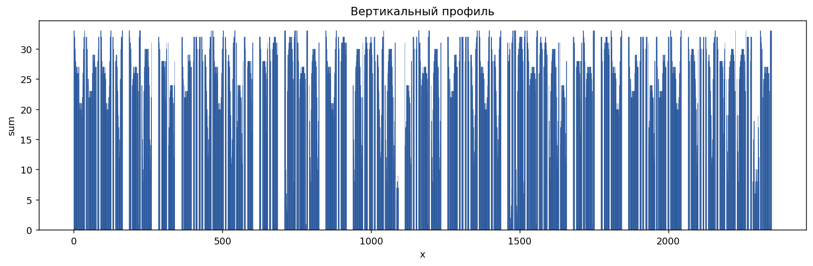

Горизонтальный профиль:

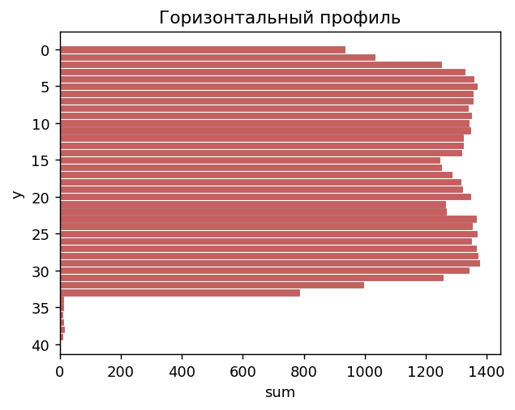

Найденная текстовая область:

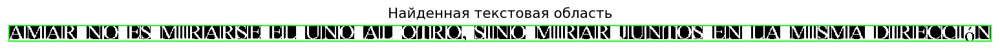

Прямоугольники сегментов:

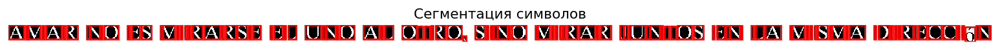

Галерея вырезанных сегментов:

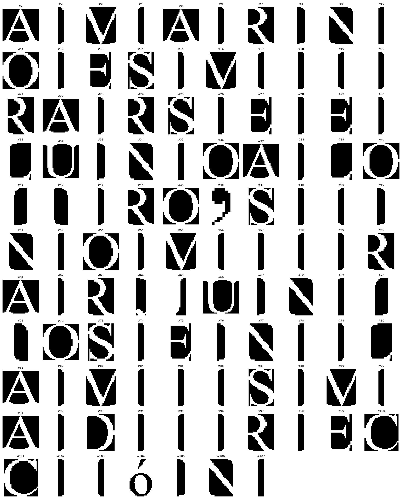

### Координаты обрамляющих прямоугольников (фрагмент)

Полный список из `107` прямоугольников находится в `lab6/results/symbol_boxes.csv`.

| № | `x_left` | `y_top` | `x_right` | `y_bottom` | Размер | Вес |
| --- | --- | --- | --- | --- | --- | --- |
| `01` | `0` | `0` | `36` | `33` | `37 x 34` | `966` |
| `02` | `41` | `1` | `45` | `32` | `5 x 32` | `153` |
| `03` | `48` | `0` | `74` | `33` | `27 x 34` | `683` |
| `04` | `80` | `1` | `84` | `32` | `5 x 32` | `154` |
| `05` | `89` | `0` | `125` | `33` | `37 x 34` | `966` |
| `06` | `130` | `1` | `134` | `32` | `5 x 32` | `154` |
| `07` | `140` | `0` | `163` | `33` | `24 x 34` | `591` |
| `08` | `186` | `1` | `192` | `33` | `7 x 33` | `218` |
| `09` | `195` | `0` | `216` | `33` | `22 x 34` | `568` |
| `10` | `219` | `1` | `223` | `33` | `5 x 33` | `164` |
| `11` | `228` | `0` | `261` | `33` | `34 x 34` | `788` |
| `12` | `284` | `1` | `288` | `32` | `5 x 32` | `157` |
| `13` | `294` | `0` | `312` | `33` | `19 x 34` | `505` |
| `14` | `317` | `0` | `339` | `33` | `23 x 34` | `489` |
| `15` | `362` | `1` | `366` | `32` | `5 x 32` | `153` |

### Профили символов выбранного алфавита

Для всех 27 символов испанского алфавита построены профили `X` и `Y`.

- общий обзор: `lab6/results/06_alphabet_gallery.png`
- по каждому символу: `lab6/results/alphabet_profiles/*`

Общая галерея:

#### Примеры

Символ `A`:

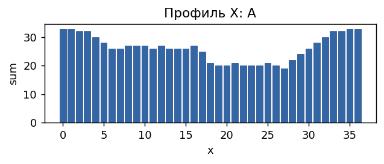
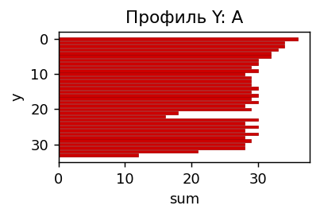

Символ `Ñ`:

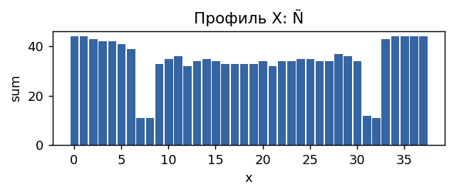
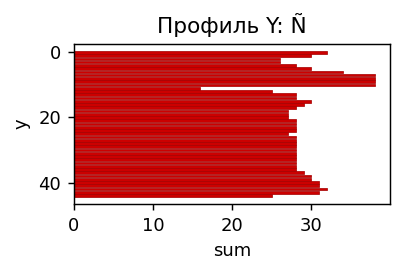

Символ `Z`:

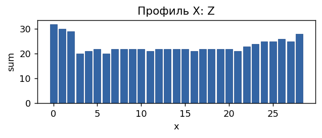
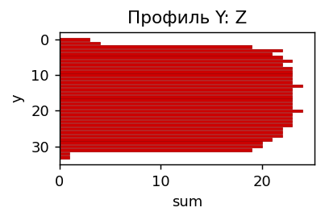

### Вывод

Лабораторная работа №6 для варианта 14 выполнена полностью: подготовлена испанская фраза в отдельном BMP, реализованы профили и сегментация текста с прореживанием, сохранены прямоугольники сегментов и графики, а также построены профили всех символов алфавита из ЛР5.

