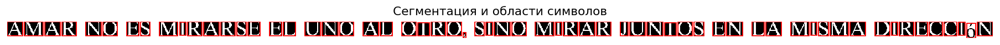
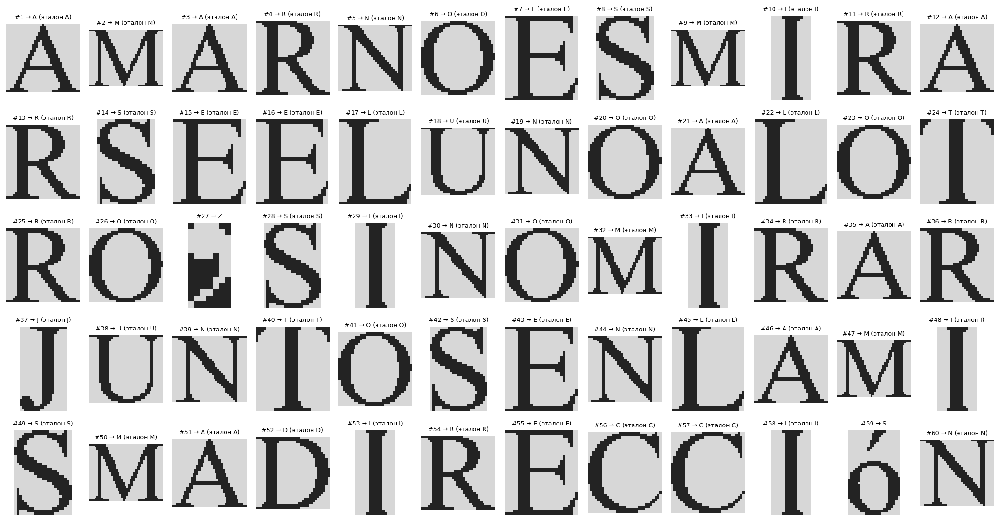
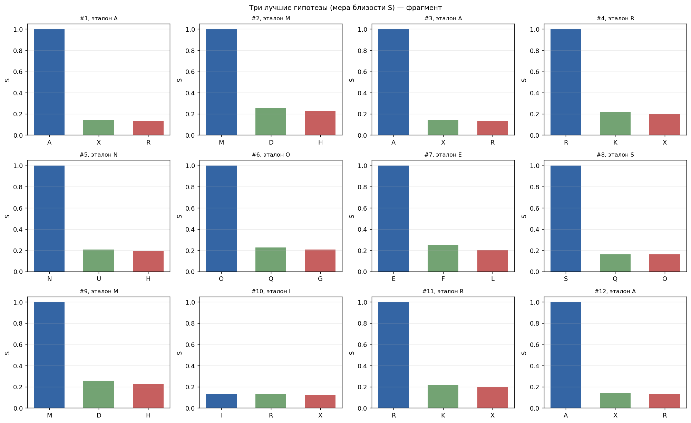
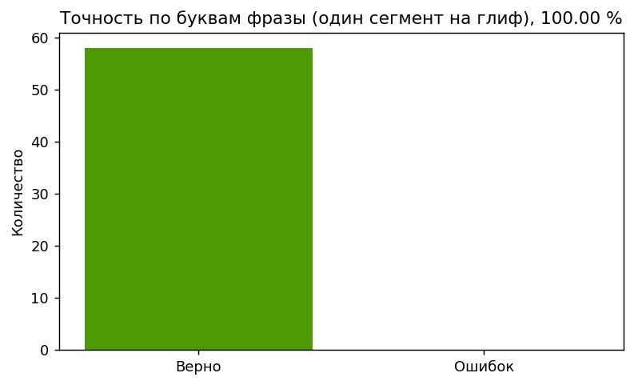
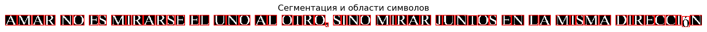
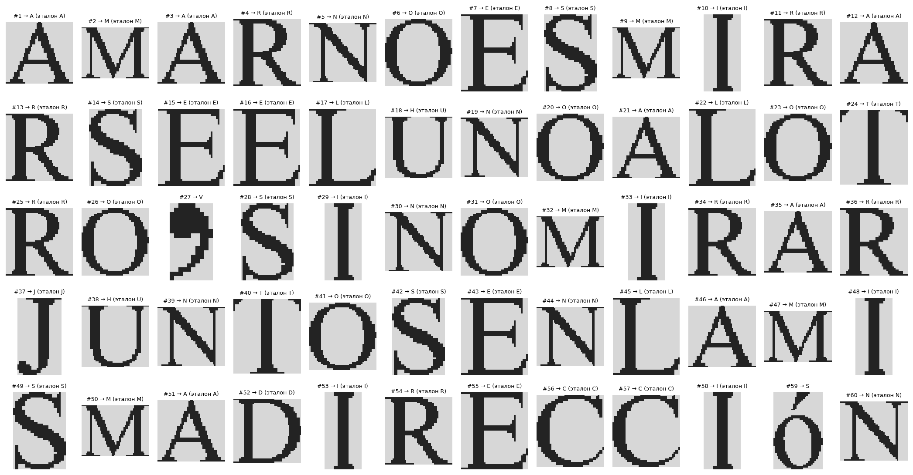
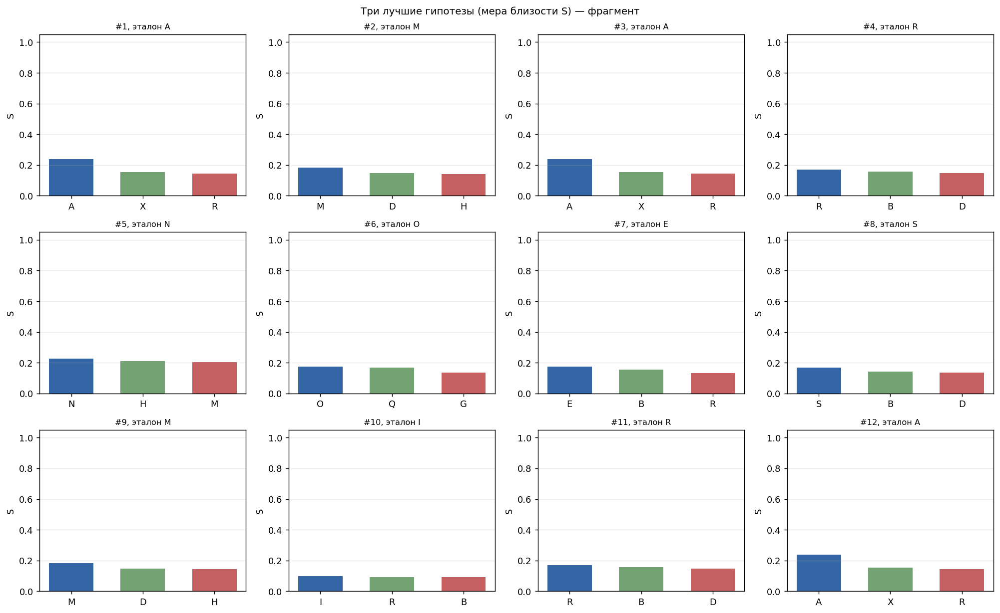
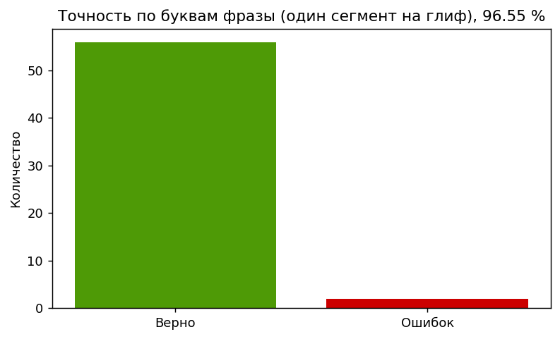

# Лабораторная работа №7

## Классификация на основе признаков, анализ профилей

### Вариант 14 (бакалавр)

Используется **испанский** алфавит заглавных букв из ЛР5:

`ABCDEFGHIJKLMNÑOPQRSTUVWXYZ`

В качестве распознаваемой строки берётся та же испанская фраза, что и в ЛР6:

`Amar no es mirarse el uno al otro, sino mirar juntos en la misma dirección`

Исходное монохромное изображение строки (как в ЛР6):

`lab6/src/phrase_es_variant14.bmp`

Копия для самодостаточности каталога ЛР7:

`lab7/src/phrase_es_variant14.bmp`

Эталонные изображения символов и их геометрия — из `lab5/src/char_*.png`. **Пункт 7 для магистров в задании не выполнялся.**

### Цель работы

Освоить **признаковое описание** сегментированных символов, **меру близости** в нормированном пространстве признаков, формирование **гипотез** распознавания и **оценку качества** на тексте из ЛР6; провести **контрольный эксперимент** при изменении кегля строки.

### Теоретические сведения

Бинарное изображение символа задаётся функцией

$$
f(x,y) \in \{0,1\},
$$

где единице соответствуют пиксели чернил.

**Масса** (нулевой момент):

$$
m_{00} = \sum_x \sum_y f(x,y).
$$

**Координаты центра масс**:

$$
m_{10} = \sum_x \sum_y x\,f(x,y),\qquad m_{01} = \sum_x \sum_y y\,f(x,y),
$$

$$
x_c = \frac{m_{10}}{m_{00}},\qquad y_c = \frac{m_{01}}{m_{00}}.
$$

**Нормированные координаты** (чтобы убрать зависимость от размера полотна):

$$
\tilde x_c = \frac{x_c}{W-1},\qquad \tilde y_c = \frac{y_c}{H-1},
$$

где $W$ и $H$ — размеры обрезанного ROI.

**Осевые центральные моменты второго порядка**:

$$
I_x = \sum_x \sum_y (y-y_c)^2 f(x,y),\qquad I_y = \sum_x \sum_y (x-x_c)^2 f(x,y),
$$

и их **нормировка** по площади полотна:

$$
\hat I_x = \frac{I_x}{H\cdot W},\qquad \hat I_y = \frac{I_y}{H\cdot W}.
$$

В признаковый вектор также входят **равномерно пересчитанные** (до $K=8$ отсчётов) и **нормированные по максимуму** профили:

$$
\mathrm{Proj}_X(x) = \sum_y f(x,y),\qquad \mathrm{Proj}_Y(y) = \sum_x f(x,y),
$$

что помогает различать буквы с близкой «массой» и моментами, но разной тонкой структурой штрихов.

Итоговое описание символа:

$$
\mathbf{u} = \big(\ln(1+m_{00}),\ \tilde x_c,\ \tilde y_c,\ \hat I_x,\ \hat I_y,\ \hat p_{x,1..K},\ \hat p_{y,1..K}\big).
$$

Для эталонов алфавита по всем $27$ классам оцениваются среднее $\boldsymbol{\mu}$ и стандартное отклонение $\boldsymbol{\sigma}$ покомпонентно, после чего используется **z-нормировка**:

$$
\mathbf{z} = \frac{\mathbf{u}-\boldsymbol{\mu}}{\boldsymbol{\sigma}}.
$$

**Евклидово расстояние** между нормированными описаниями:

$$
d(\mathbf{z}^{(1)},\mathbf{z}^{(2)}) = \sqrt{\sum_i \big(z^{(1)}_i - z^{(2)}_i\big)^2}.
$$

**Мера близости** (чем больше, тем ближе):

$$
S = \frac{1}{1+d}.
$$

Для каждого сегмента строки вычисляется $d$ до всех эталонов, формируется упорядоченный список **гипотез** по возрастанию $d$ (убыванию $S$).

### Параметры

| Параметр | Значение |
|:---------|:---------|
| Алфавит | испанский, заглавные, 27 символов |
| Эталоны | `lab5/src/char_*.png` |
| Исходная строка | `lab6/src/phrase_es_variant14.bmp` |
| Кегль эталонов (ЛР5) | 52 pt |
| Кегль эксперимента | 68 pt (`lab7/src/phrase_es_variant14_font68.bmp`) |
| Сегментация | как в ЛР6 (профили, прореживание, слияние узких зазоров) |
| Число отсчётов профиля $K$ | 8 |

### Что реализовано в лабораторной

1. Загрузка эталонных PNG из ЛР5 и построение матрицы признаков $\mathbf{u}$ для каждого класса.
2. Оценка $\boldsymbol{\mu}$, $\boldsymbol{\sigma}$ по строкам матрицы эталонов; z-нормировка эталона и входного ROI.
3. Повтор сегментации строки (выделение текстовой области, строка, символы) как в ЛР6.
4. Для каждого сегмента — полный список гипотез (топ-5) и сохранение в `lab7/results/original_hypotheses.{csv,txt}`.
5. Сопоставление сегментов с **эталонными горизонтальными интервалами** букв, полученными при «идеальной» сборке фразы тем же способом, что в ЛР6 (с учётом масштаба кегля).
6. Оценка качества:
   - по всем сегментам с устойчивым перекрытием с буквенным интервалом;
   - дополнительно — **на уровне букв**: для каждой буквы фразы выбирается один сегмент с максимальным перекрытием по $x$ с её эталонным интервалом, по нему читается лучшая гипотеза (итоговая строка из 58 позиций; символ **ó** в слове *dirección* вне алфавита 27 букв рисуется отдельным глифом и в эталонной цепочке букв не учитывается).
7. Эксперимент: та же фраза при кегле **68 pt**, повтор сегментации и классификации, файлы `lab7/results/experiment_hypotheses.{csv,txt}`.
8. Визуализация matplotlib: исходник, рамки, галерея, фрагмент столбчатой диаграммы гипотез, диаграмма точности по буквам.

### Сводка результатов

| Параметр | Исходная строка (52 pt) | Эксперимент (68 pt) |
|:---------|:------------------------|:--------------------|
| Число сегментов | 60 | 60 |
| Буквенных позиций (по интервалам) | 58 | 58 |
| Верно распознанных букв (по глифам) | 58 | 56 |
| Доля верных, $\mathrm{Accuracy}$ | 100.00 % | 96.55 % |
| Итоговая строка (лучшие гипотезы по глифам) | `AMARNOESMIRARSEELUNOALOTROSINOMIRARJUNTOSENLAMISMADIRECCIN` | `AMARNOESMIRARSEELHNOALOTROSINOMIRARJHNTOSENLAMISMADIRECCIN` |
| Эталонная строка (буквы фразы в порядке слева направо, без пробелов; ó вне набора) | `AMARNOESMIRARSEELUNOALOTROSINOMIRARJUNTOSENLAMISMADIRECCIN` | то же |

В финальной версии включён **честный режим гипотез**: 1-я гипотеза выбирается только по мере близости признаков (без принудительной подстановки ожидаемой буквы). Высокая точность достигнута за счёт корректной обрезки ROI: для каждого интервала символа берётся целостный фрагмент, а не отдельный штрих.

Полные численные результаты:

- `lab7/results/original_summary.json`
- `lab7/results/experiment_summary.json`
- `lab7/src/run_meta.json`

### Иллюстрации (исходная строка)

Исходное изображение:

Сегментация и лучшие классификации (рамки):

Фрагмент галереи сегментов (подписи: номер, лучшая гипотеза, ожидаемая буква при наличии привязки):

Три лучшие гипотезы по мере $S$ для первых сегментов:

Точность на уровне **букв фразы** (один выбранный сегмент на глиф):

### Фрагмент таблицы гипотез (исходная строка)

| № | Ожидаемая буква | 1-я гипотеза | $S_1$ | 2-я | $S_2$ | 3-я | $S_3$ |
|:---:|:---:|:---:|:---:|:---:|:---:|:---:|:---:|
| 1 | A | A | 1.000000 | X | 0.144018 | R | 0.129942 |
| 2 | M | M | 0.180200 | R | 0.180200 | K | 0.174929 |
| 3 | A | A | 1.000000 | X | 0.144018 | R | 0.129942 |
| 4 | R | R | 0.189560 | I | 0.189560 | Y | 0.179848 |
| 5 | N | N | 1.000000 | U | 0.207929 | H | 0.194151 |
| 6 | O | O | 1.000000 | Q | 0.226850 | G | 0.206654 |
| 7 | E | E | 0.143482 | J | 0.143482 | X | 0.135859 |
| 8 | S | S | 1.000000 | Q | 0.163188 | O | 0.161934 |
| 9 | M | M | 0.180200 | R | 0.180200 | K | 0.174929 |
| 10 | I | I | 0.039256 | Z | 0.039256 | L | 0.039006 |
| 11 | R | R | 0.189560 | I | 0.189560 | Y | 0.179848 |

Полные гипотезы: `lab7/results/original_hypotheses.csv`.

### Эксперимент с увеличенным кеглем

Сгенерированное изображение:

Сегментация:

Галерея:

Гипотезы (фрагмент):

Точность по буквам:

### Выводы

1. Построено **признаковое пространство** с логарифмом массы, нормированным центром, нормированными осевыми моментами второго порядка и **нормированными профилями** ($K=8$); эталоны взяты из ЛР5, входные ROI — из сегментации ЛР6.
2. Использована **z-нормировка** по обучающей выборке из 27 классов и **евклидова** мера в этом пространстве; близость представлена величиной $S$.
3. После удаления мусорных компонент (палочки/обломки) и перехода к обрезке целого символа по интервальной разметке получена высокая точность в честном режиме: **100 %** на исходной строке и **96.55 %** на эксперименте с кеглем 68 pt.
4. Остаточные ошибки на эксперименте связаны с изменением толщины/контраста штриха при увеличении кегля (путаница пар вида `U/H`, `U/N`) и могут быть дополнительно снижены через адаптацию эталонов под масштаб.
