# Лабораторная работа №8

## Текстурный анализ и контрастирование изображений

### Вариант 14

По условию варианта `14` требуется:

- матрица текстурных серий `GLRLM`;
- признаки `SRE` и `LRE`;
- метод преобразования яркости: **логарифмическое**.

## Цель работы

1. Построить `GLRLM` для исходных и контрастированных изображений.
2. Рассчитать признаки `SRE` и `LRE`.
3. Применить логарифмическое преобразование яркости.
4. Сравнить гистограммы яркости и текстурные признаки до/после преобразования.

## План выполнения лабораторной

1. Загрузить исходные цветные изображения из `lab8/src`.
2. Перевести изображения в модель `HSL` и выделить канал яркости `L`.
3. Для исходного `L`:
   - сохранить полутоновое изображение;
   - построить гистограмму яркости;
   - построить `GLRLM`;
   - вычислить `SRE` и `LRE`.
4. Выполнить логарифмическое преобразование канала `L`.
5. Собрать контрастированное цветное изображение (с исходными `H`, `S` и новым `L`).
6. Для преобразованного изображения снова вычислить гистограмму, `GLRLM`, `SRE`, `LRE`.
7. Визуализировать матрицы `GLRLM` в градациях серого с логарифмической нормировкой.
8. Сравнить результаты и сформулировать выводы.

## Теоретические сведения

### 1. Матрица `GLRLM`

Матрица длин серий уровней серого `GLRLM` описывает, сколько раз встречается серия длины `r` для уровня яркости `g` в выбранных направлениях сканирования.

В работе использованы направления:

- `0°`,
- `45°`,
- `90°`,
- `135°`.

Итоговая матрица получена суммированием матриц по этим направлениям.

Пусть `P(g, r)` - элемент `GLRLM`, а

$$
N_r = \sum_g \sum_r P(g, r)
$$

-- общее число серий.

### 2. Текстурные признаки варианта

**Short Run Emphasis (`SRE`)**:

$$
SRE = \frac{1}{N_r}\sum_{r=1}^{R}\frac{\sum_g P(g,r)}{r^2}.
$$

Большие значения `SRE` соответствуют преобладанию коротких серий.

**Long Run Emphasis (`LRE`)**:

$$
LRE = \frac{1}{N_r}\sum_{r=1}^{R} r^2 \sum_g P(g,r).
$$

Большие значения `LRE` соответствуют преобладанию длинных серий.

### 3. Логарифмическое преобразование яркости

Для яркостного канала `L` рассчитываются:

- среднее `mean`,
- минимальная яркость `f_{min}`,
- максимальная яркость `f_{max}`.

Коэффициенты:

$$
\alpha_+ = \frac{f_{max}-mean}{\ln(\max(2, f_{max}-mean+1))},\qquad
\alpha_- = \frac{mean-f_{min}}{\ln(\max(2, mean-f_{min}+1))}.
$$

Пусть

$$
f' = f - mean.
$$

Тогда новое значение яркости:

$$
g =
\begin{cases}
mean + \alpha_+\ln(1+f'), & f' \ge 0,\\
mean - \alpha_-\ln(1-f'), & f' < 0.
\end{cases}
$$

Преобразование применялось только к каналу `L` в `HSL`, чтобы не искажать тон и насыщенность.

## Реализация

Практическая часть реализована в скрипте:

- `lab8/codeFor8.py`.

Что делает скрипт:

1. Обрабатывает 3 изображения в требуемом порядке.
2. Строит `GLRLM` для исходного и преобразованного каналов `L`.
3. Вычисляет `SRE`, `LRE` до/после преобразования.
4. Строит гистограммы яркости до/после.
5. Сохраняет матрицы `GLRLM` в виде изображений (`log(1+x)` нормировка для читаемости).
6. Сохраняет сводную таблицу:
   - `lab8/src/variant14_summary.csv`.

## Численные результаты

| Изображение | SRE (до) | SRE (после) | \u0394SRE | LRE (до) | LRE (после) | \u0394LRE |
|:--|--:|--:|--:|--:|--:|--:|
| `01_letopis` | 0.809699 | 0.761792 | -0.047907 | 4.297621 | 14.831987 | +10.534365 |
| `02_basketball` | 0.928949 | 0.891244 | -0.037704 | 1.939567 | 3.226358 | +1.286792 |
| `03_football` | 0.930433 | 0.901040 | -0.029393 | 1.400436 | 1.711303 | +0.310868 |

Наблюдения:

- во всех случаях `SRE` уменьшается;
- во всех случаях `LRE` увеличивается.

Это означает, что после логарифмического контрастирования вклад более длинных серий становится выше, а доля коротких серий относительно снижается.

## Визуальные результаты

### 1) Летопись (`original_03.png`)

Компоновка результата:

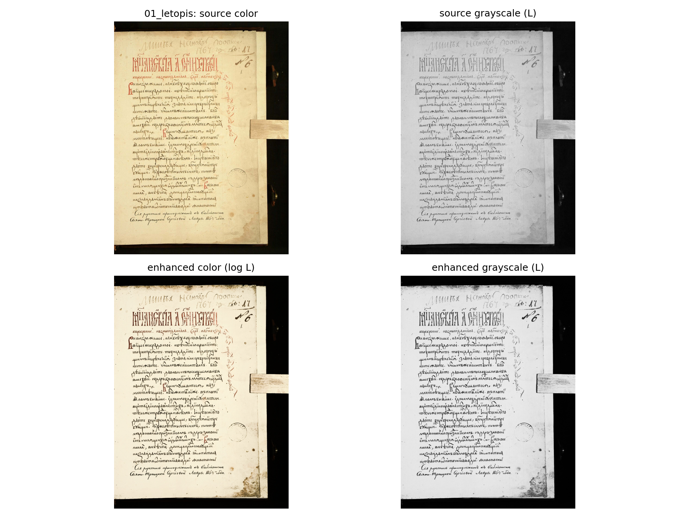

Гистограммы:

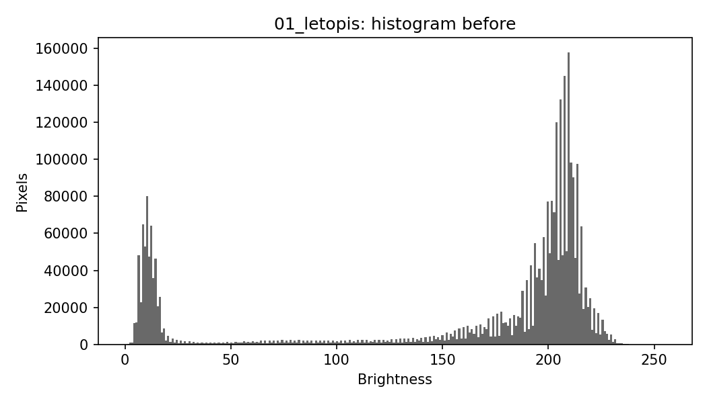
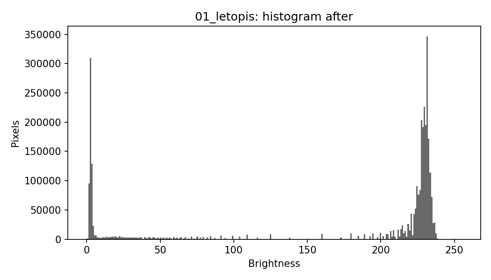

Матрицы `GLRLM`:

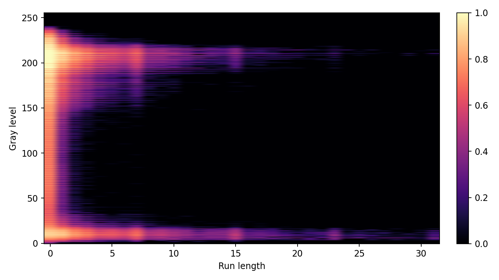
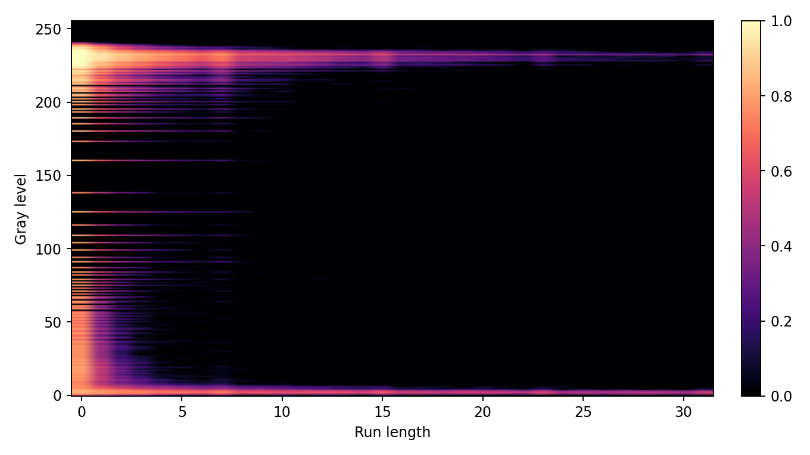

Подпись к паре `GLRLM`:
- 1 - `до` логарифмического контрастирования, справа — `после`;
- 2- после преобразования заметно усиливаются области с большими длинами серий (рост вклада длинных пробегов), что согласуется с увеличением `LRE`.

### 2) Баскетбол (`orig2.png`)

Компоновка результата:

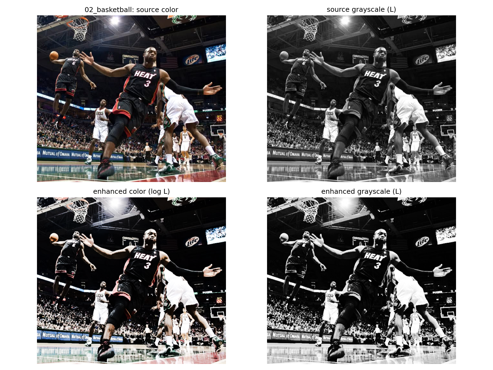

Гистограммы:

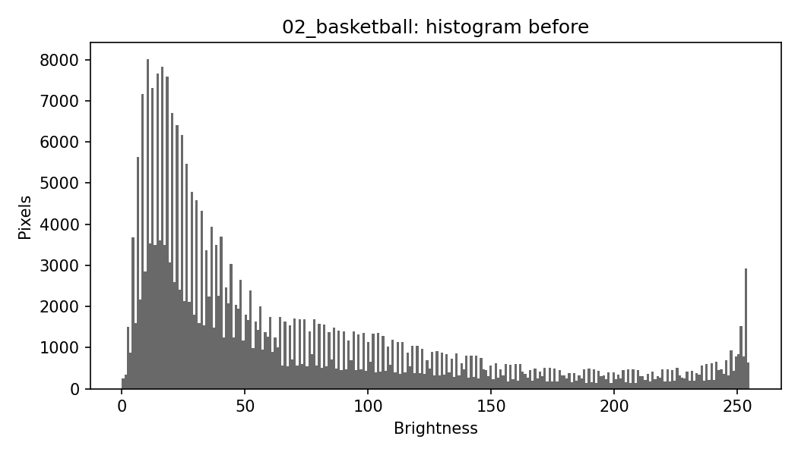
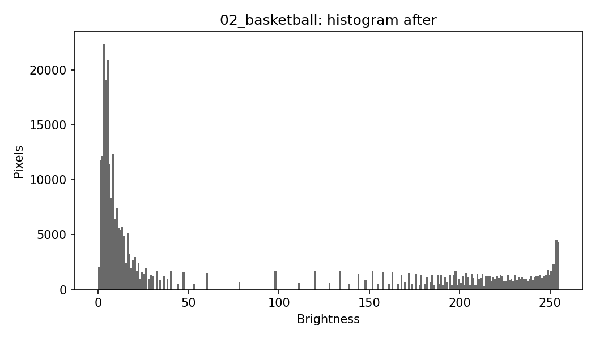

Матрицы `GLRLM`:

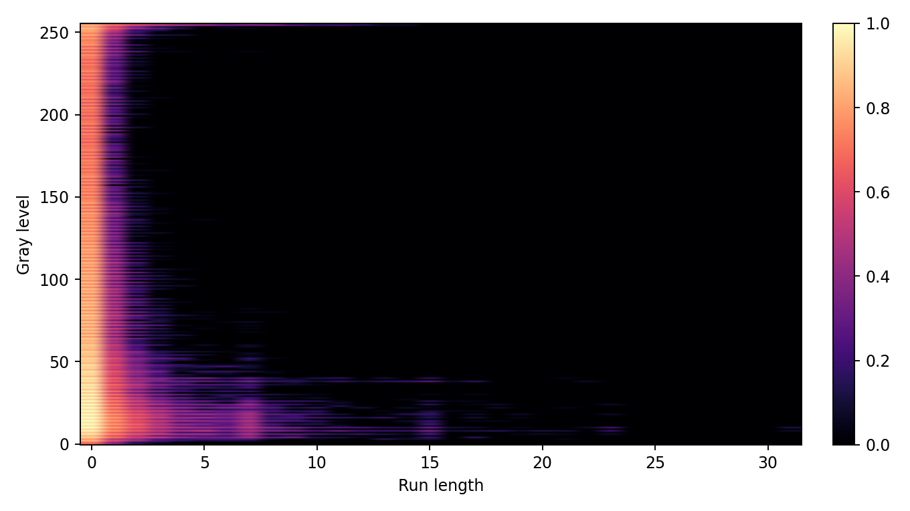
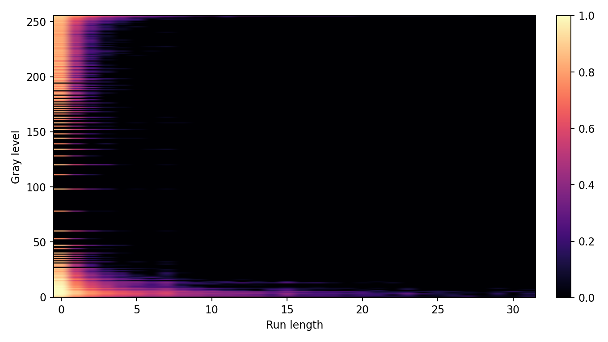

Подпись к паре `GLRLM`:
- 1 - `до`, справа — `после` логарифмического преобразования;
- 2 -распределение после обработки становится менее концентрированным у самых коротких серий и более выраженным в средних/длинных длинах, что отражает снижение `SRE` и рост `LRE`.

### 3) Футбол (`orig1.png`)

Компоновка результата:

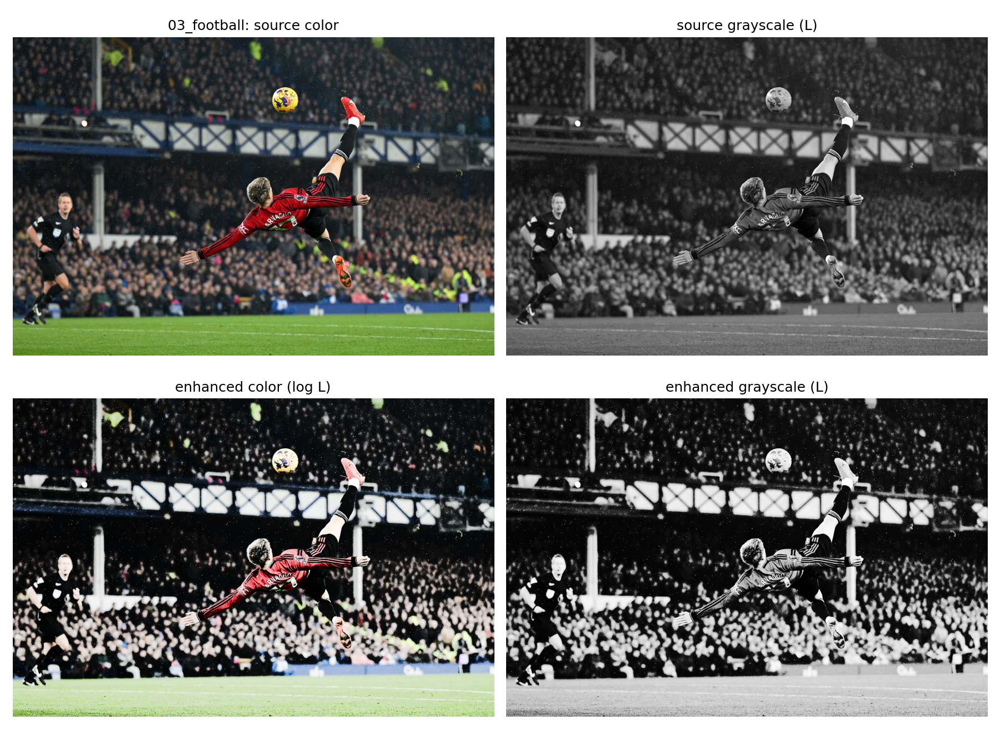

Гистограммы:

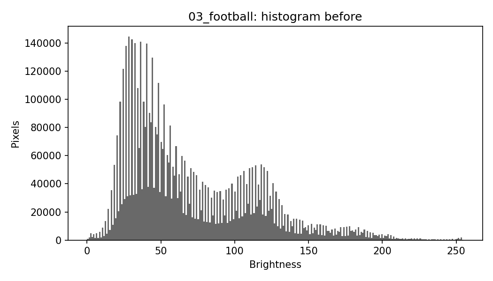
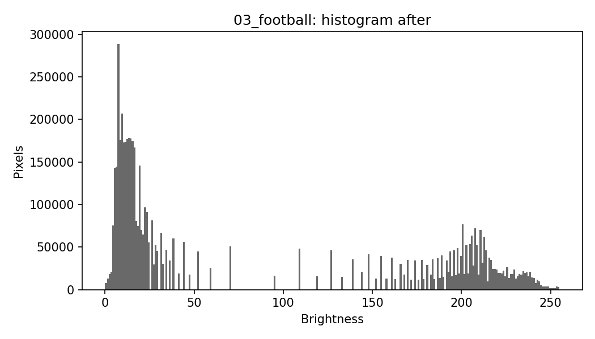

Матрицы `GLRLM`:

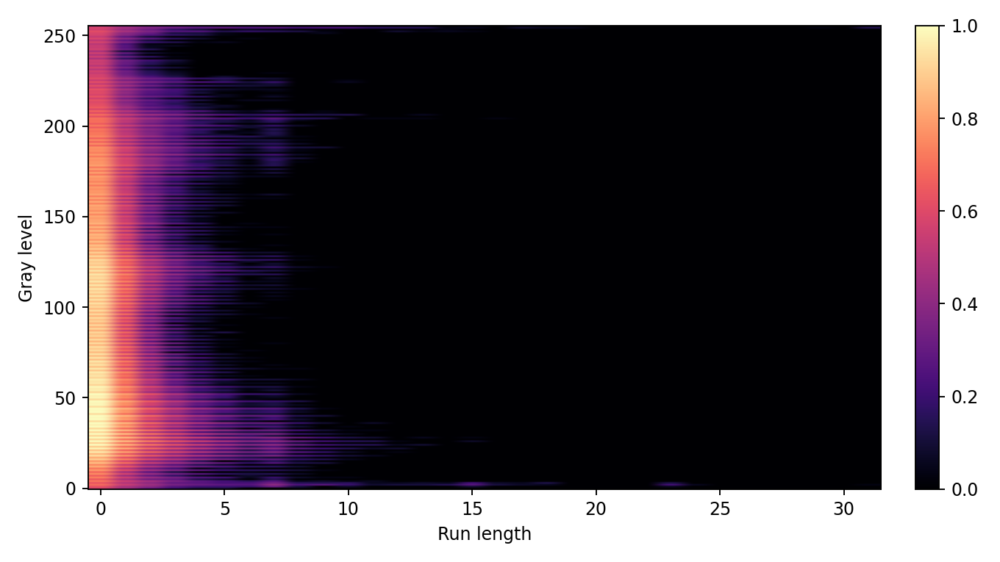
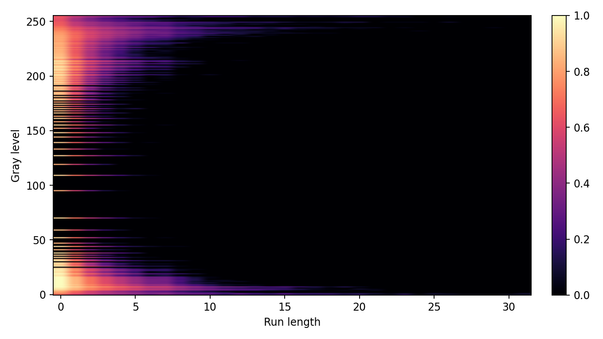

Подпись к паре `GLRLM`:
- 1 - матрица исходного изображения, справа — после логарифмического контрастирования;
- 2 - после обработки возрастает видимость структур в области более длинных серий и немного уменьшается доминирование коротких серий (что подтверждается изменениями `SRE`/`LRE`).

## Вывод

В лабораторной работе для варианта `14` выполнены все требуемые пункты:

1. Построены матрицы `GLRLM` для трёх изображений.
2. Рассчитаны признаки `SRE` и `LRE` до и после обработки.
3. Применено логарифмическое преобразование яркости в канале `L` цветовой модели `HSL`.
4. Построены и сравнены гистограммы яркости до/после.
5. Проведён сравнительный анализ признаков:
   - `SRE` снизился,
   - `LRE` вырос,
   что подтверждает перераспределение текстурных серий после контрастирования.
