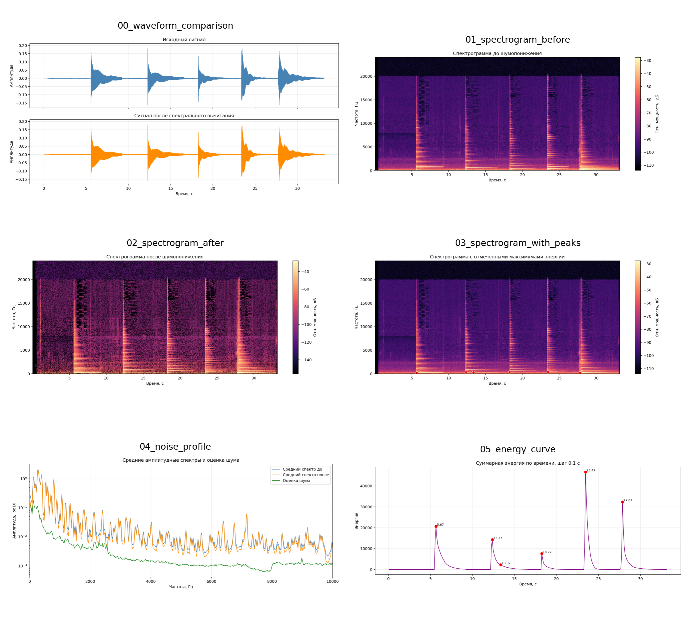
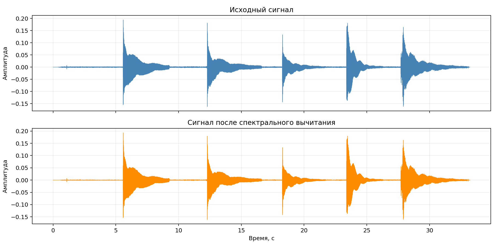
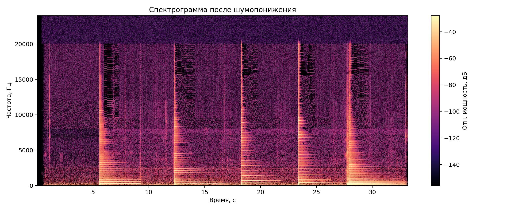
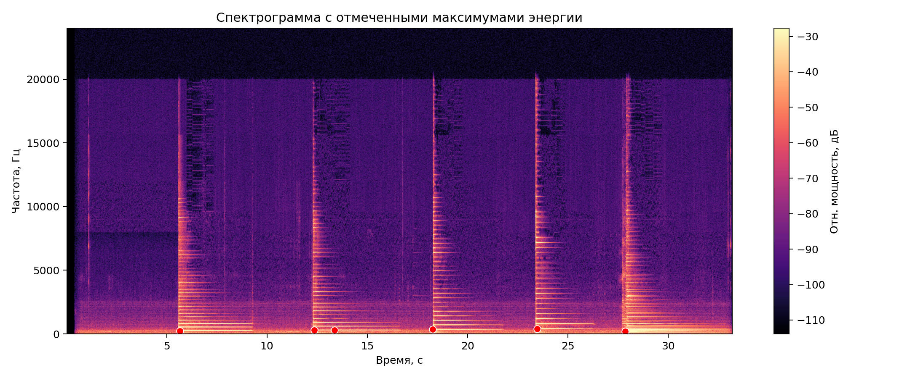
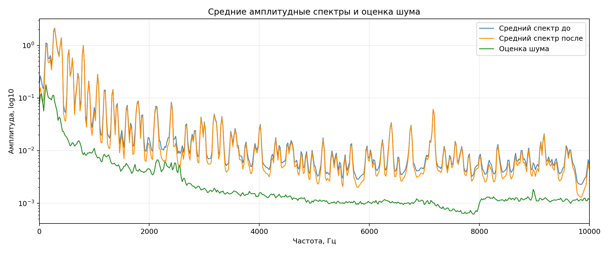
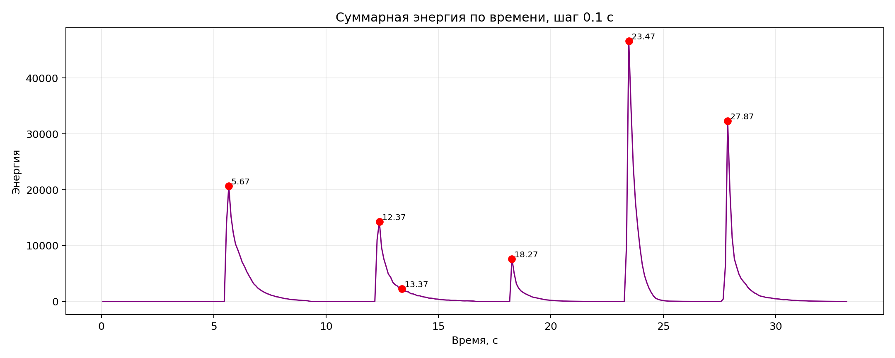

# Лабораторная работа №9

## Анализ шума в аудиосигнале

### Цель работы

1. Построить спектрограмму записи музыкального инструмента.
2. Оценить уровень шума по малоэнергетическим участкам сигнала.
3. Выполнить шумопонижение методом спектрального вычитания.
4. Сравнить сигнал и спектрограммы до и после обработки.
5. Найти моменты наибольшей энергии при шагах $\Delta t = 0.1$ с и $\Delta f = 40$ Гц.

### Теоретические сведения

**Кратковременное преобразование Фурье** задаётся выражением

$$
X(m, \omega) = \sum_n x[n] \, w[n-m] \, e^{-j\omega n},
$$

где $x[n]$ — дискретный аудиосигнал, $w[n]$ — оконная функция, $m$ — номер временного положения окна.

**Спектрограмма** строится по квадрату модуля локального спектра:

$$
S(m, \omega) = |X(m, \omega)|^2.
$$

В работе применяется **окно Ханна**

$$
w(n) = 0.5 - 0.5\cos\left(\frac{2\pi n}{N-1}\right),
$$

так как оно уменьшает спектральные утечки и хорошо подходит для анализа музыкальных сигналов.

Для оценки качества подавления шума используется приближённая оценка отношения сигнал/шум по RMS:

$$
\mathrm{SNR} = 20\log_{10}\left(\frac{A_{\mathrm{signal}}}{A_{\mathrm{noise}}}\right),
$$

где $A_{\mathrm{signal}}$ и $A_{\mathrm{noise}}$ — среднеквадратические амплитуды активных и тихих участков сигнала соответственно.

Метод **спектрального вычитания** реализуется по формуле

$$
Y(f,t) = \max\bigl(X(f,t) - kW(f), 0\bigr),
$$

где $X(f,t)$ — амплитудный спектр исходного сигнала, $W(f)$ — оценка спектра шума, $k$ — коэффициент подавления. В данной работе взято

$$
k = 1.0.
$$

Шум оценивается автоматически по наименее энергичным кадрам: для каждого окна STFT вычисляется RMS, затем выбираются $10\%$ кадров с минимальной энергией, и по ним усредняется амплитудный спектр шума.

Для поиска энергетических максимумов используется временная сетка

$$
\Delta t = 0.1 \text{ с}
$$

и частотная сетка

$$
\Delta f = 40 \text{ Гц}.
$$

Так как при выбранном размере окна шаг STFT по частоте равен $20$ Гц, соседние частотные бины объединяются попарно.

### Исходные данные

Параметры записи:

| Параметр | Значение |
|:---|:---|
| Формат | `WAV` |
| Число каналов | `1` |
| Разрядность | `16` бит |
| Частота дискретизации | `48000` Гц |
| Число отсчётов | `1594560` |
| Длительность | `33.22` с |

### План выполнения

1. Загрузить исходный WAV-файл и привести его к вещественному моно-сигналу.
2. Построить STFT с окном Ханна длиной `50 мс` и перекрытием `75 %`.
3. Найти тихие кадры по RMS и получить усреднённый спектр шума.
4. Выполнить спектральное вычитание с сохранением исходной фазы и восстановить очищенный сигнал.
5. Построить сравнение временных форм, спектрограмм, среднего спектра и кривой энергии.
6. Найти моменты максимальной энергии на сетке `Δt = 0.1 с`, `Δf = 40 Гц`.

### Основные параметры обработки

| Параметр | Значение |
|:---|:---|
| Размер окна STFT | `2400` отсчётов |
| Длительность окна | `0.0500` с |
| Шаг окна | `600` отсчётов |
| Шаг по времени STFT | `0.0125` с |
| Частотный шаг STFT | `20` Гц |
| Всего кадров | `2655` |
| Тихих кадров для оценки шума | `266` |
| Коэффициент подавления $k$ | `1.0` |

Выбор параметров согласуется с лекцией: при $F_s = 48000$ Гц и длине окна около $50$ мс получаем

$$
N = 0.05 \cdot F_s = 2400,
$$

а при перекрытии $75\%$ шаг окна равен

$$
H = 0.25N = 600.
$$

Соответственно, частотный шаг STFT составляет

$$
\Delta f_{\mathrm{STFT}} = \frac{F_s}{N} = \frac{48000}{2400} = 20 \text{ Гц}.
$$

### Оценка уровня шума

| Показатель | До | После |
|:---|---:|---:|
| `RMS` на тихих участках | `0.000489` | `0.000201` |
| `RMS` на активных участках | `0.036631` | `0.036456` |
| Оценка `SNR`, дБ | `37.488353` | `45.152685` |

По численным значениям видно следующее:

1. Амплитуда шумового фона на тихих участках уменьшилась примерно на **58.82 %**.
2. По мощности шум на тихих участках уменьшился примерно на **83.04 %**.
3. Полезная амплитуда на активных участках изменилась незначительно: снижение около **0.48 %**.
4. Оценка `SNR` выросла на **7.66 дБ**.

Это говорит о том, что спектральное вычитание в данном варианте заметно подавило фон, почти не затронув основные атаки и затухания гитарных нот.

### Моменты наибольшей энергии

Ниже приведены `6` наиболее сильных временных максимумов энергии на сетке `Δt = 0.1 с`. Для каждого момента указана доминирующая полоса `40` Гц.

| № | Центр по времени, с | Суммарная энергия | Доминирующая полоса, Гц | Энергия доминирующей полосы |
|:---:|---:|---:|:---:|---:|
| `1` | `23.47` | `46664.917868` | `390..430` | `31252.173835` |
| `2` | `27.87` | `32325.119210` | `190..230` | `18734.394916` |
| `3` | `5.67` | `20648.193768` | `230..270` | `8567.107638` |
| `4` | `12.37` | `14263.521737` | `270..310` | `6993.188846` |
| `5` | `18.27` | `7650.879955` | `350..390` | `1542.235433` |
| `6` | `13.37` | `2295.236247` | `270..310` | `1618.660657` |

Самый мощный максимум энергии наблюдается около **23.47 с**, а следующий по силе — около **27.87 с**.

### Визуальные результаты

### Итоговая панель

### Временная форма сигнала

На временной форме видно, что крупные атаки сигнала после обработки сохранились, а низкоамплитудный фон между ними уменьшился.

### Спектрограммы до и после обработки

До шумопонижения:

После шумопонижения:

По спектрограммам заметно, что:

1. В паузах и между атаками спектральный фон стал слабее.
2. Основные гармоники гитары в низко- и среднечастотной областях сохранились.
3. После обработки исчезла часть слабой высокочастотной зернистости, но структура полезного сигнала осталась различимой.

### Моменты максимальной энергии

Красными маркерами отмечены найденные временные максимумы энергии; положение точки по вертикали соответствует доминирующей полосе `40` Гц в соответствующий момент.

### Средний спектр и оценка шума

Зелёная кривая соответствует оценке спектра шума по тихим кадрам. Она лежит заметно ниже среднего спектра полезного сигнала, а после шумопонижения средний спектр на основных гармониках изменяется мало.

### Энергия по времени

График суммарной энергии по времени хорошо выделяет основные атаки. Наиболее сильные всплески приходятся примерно на `5.67`, `12.37`, `18.27`, `23.47` и `27.87` секунды.

### Полученные файлы

В ходе работы были автоматически сформированы:

- `lab9/src/audio_guitar_denoised.wav` — результат шумопонижения;
- `lab9/src/audio_metrics.json` — сводка параметров и численных результатов;
- `lab9/src/top_energy_peaks.csv` — таблица максимумов энергии;
- `lab9/src/00_waveform_comparison.png` ... `lab9/src/06_panel.png` — иллюстрации для отчёта.

### Выводы

1. Построена спектрограмма аудиосигнала гитары по STFT с окном Ханна длиной `50 мс` и перекрытием `75 %`.
2. Шум автоматически оценён по `10 %` кадров с минимальным RMS, после чего выполнено спектральное вычитание с коэффициентом `k = 1.0`.
3. Шумовой фон на тихих участках уменьшился существенно, при этом амплитуда активных фрагментов изменилась менее чем на `1 %`.
4. Оценка отношения сигнал/шум выросла с `37.49` до `45.15` дБ, что подтверждает эффективность обработки для данного файла.
5. Найдены моменты наибольшей энергии на сетке `Δt = 0.1 с`, `Δf = 40 Гц`; самый сильный максимум расположен около `23.47` с.
